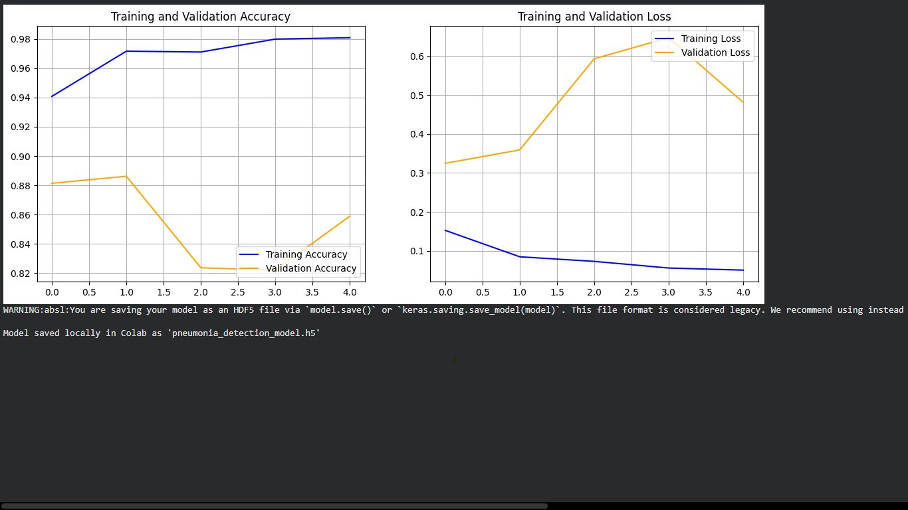

# chest-xray-cnn-diagnostic
A deep learning tool for pediatric pneumonia detection using Transfer Learning (MobileNetV2)
# Pediatric Pneumonia Detection via Chest X-Ray Analysis

## Clinical Rationale
Pneumonia accounts for a significant percentage of pediatric hospitalizations globally. Rapid and accurate radiological screening is critical for early intervention, yet resource-limited settings often face a shortage of specialized radiologists. This project develops a computer vision diagnostic tool to serve as an automated second opinion, classifying pediatric chest X-rays into "Normal" or "Pneumonia" categories.

## Dataset
*   **Source:** Kaggle Chest X-Ray Images (Pediatric)
*   **Volume:** 5,863 standardized anterior-posterior chest X-ray images.
*   **Preprocessing:** Images were uniformly resized to 224x224 pixels and normalized (scaled 0-1) to ensure feature extraction stability.

## Model Architecture
To maximize computational efficiency, this tool leverages **Transfer Learning**.
*   **Base Model:** `MobileNetV2` (Pre-trained on ImageNet). Used strictly as a visual feature extractor.
*   **Classification Head:** A custom dense neural network with a sigmoid activation function for binary classification.
*   **Regularization:** Implemented a 20% Dropout layer to prevent model overfitting.

## Training Performance
The model was trained over 5 epochs using a cloud-based GPU (Google Colab, Tesla T4). 

*   **Final Training Accuracy:** 98 %
*   **Final Validation Accuracy:** 0.4816

## Future Pipeline Integration
The next iteration of this project involves deploying the `.h5` model file via a lightweight web framework (such as Streamlit or Flask) to create a user-friendly interface for clinician testing.
